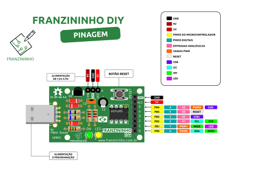

# Exemplos AVR LIBC - Franininho DIY

Esse material apresenta uma sequencia de exemplos e contéudos para programação da Franzininho DIY usando a AVR LIB C.

É importante que você tenha o [pinout da Franzininho DIY](https://github.com/Franzininho/imagens-franzininho/blob/main/franzininho_diy/Pinagem-completa-Franzininho-DIY-V2RV2.png) para fazer as ligações conforme orientações nos exemplos.




## Ferramentas necessárias

Você não precisará de um compilador específico ou IDE para compilar os exemplos apresentados. As ferramentas necessárias são:

- GCC AVR
- avr libc
- binutils-avr
- make

### Instalação das ferramentas necessárias:
```shell
sudo apt install gcc-avr
sudo apt install avr-libc
sudo apt install binutils-avr
sudo apt install make
```

A placa Franzininho deve estar com o bootloader micronucleus.


### Compilação no Linux

```shell
cd ../exemplos-avr-libc/exemplos/01-hello
make all
```


## Lista de exemplos

1. hello - Exemplo para blink LED na placa Franzinino - Apenas para garantir que toochains está ok
2. SaidaDigital - Exemplo para explorar as saídas digitais e o uso de macros
3. EntradaDigital - Exemplo para leitura de botão e acionamento de LED
4. timer0 - Exibe como usar o timer zero para temporização
5. timer0_int - Exibe como usar a interrupção do timer 0 para temporização
